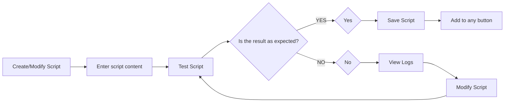

[中文](https://github.com/lclrc/SquidExtender/blob/main/README.md) | English


# SquidExtender

## Scripts(JavaScript)

### 一、Changes in Version 3.5

1. The main function **must** be an asynchronous function, which means you need to add the **async** keyword.
   For example, in the old version it was:
```js
function main(str) {
    return str.split('').reverse().join('');
}
```
   In the new version, it needs to be changed to:
```js
async function main(str) {
    return str.split('').reverse().join('');
}
```
2. main function return value add support for dictionaries and dictionary arrays, [please check](#3-dictionary) for what fields are needed in a dictionary.
3. extend scripting capability, including [open app](#4-app), [open link(e.g. url scheme)](#3-url), [networking request](#8-http), [read/write pasteboard](#2-pb), [base64 codec](#6-base64), [md5 encoding](#5-md5), [other tools](#7-util), [print log](#1-console), and so on.

### II. Script Requirements and Debugging Techniques

#### **Requirements:**
1. The script should contain at least one asynchronous async function named `main`, which can accept a parameter. When executed, the text content will be passed as a parameter to the `main` function.
2. [Return Value of main Function](#iii-the-return-value-of-the-main-function): It can be a string, a string array, a dictionary, or a dictionary array. When returning a string array or a dictionary array, all members of the array will be displayed as multiple options for selection.

#### **Writing Process and Techniques**
1. If you have a background in JavaScript or other programming languages, you can write it by hand. If not, you can copy and paste or use GPT to generate it.
   * Example GPT prompt: `Implement a JavaScript function named 'main' that is an asynchronous async function, accepting a string parameter. Process the received string and return it.
For example, process the received string as follows and return it.`
   * Ask GPT to break down a big problem into several small ones, ask step by step, otherwise it will just talk nonsense. Ask step by step, and if you are not sure, use `console.log()` after each step to print the log and see if the processing is what you want.
2. Make good use of `console.log()` to print variables and view logs, [specific usage](#1-console)
3. Writing process:



### III. The return value of the main function

#### 1. string

> The result will be inserted directly into the input box. For example, the following inverted text script: the original text is `Hello World`, and will output `dlroW olleH`

```js
async function main(str) {
    return str.split('').reverse().join('');
}
```

#### 2. String array

> When there is only one element in the array, it will be inserted directly into the input box; otherwise, the selection menu will pop up, and after selecting an item, it will be inserted into the input box. For example, the following script is split by newlines, assuming that the original text is:

```
Hello
World
```
A selection box will pop up, with the texts in the box being `Hello` and `World` respectively.

Can be used to save multiple pieces of related information in one record, and the separator can be optional.

```js
async function main(str) {
    arr = str.split("\n");
    arr.forEach((item, index)=>{
      if(!item){
          arr.splice(index, 1);
      }
    })
    return arr;
}
```

#### 3. Dictionary

> The dictionary includes fields such as `type` (type: **required**), `content` (content: **required**), and `title` (title: not required). If there is no `title` field, the content field will be used as the title.

For example, the following formats are all acceptable:
```js
async function main(str) {
    return {
      type: 'txt',
      title: 'insert ' + str,
      content: str,
    };
}
```

```js
async function main(str) {
    return {
      type: 'txt',
      content: str,
    };
}
```

##### Type `type` optional:

> txt, ~~app~~, url, urlInApp, function

1. `txt`: inserts text
2. ~~`app`: open the app. In this case, content needs to be the bundle identifier of an app. e.g.~~ Please use open url scheme instead.
3. `url`: open the link in the browser. In this case, content needs to be a valid link `http://`, `https://` or `some url scheme`. For example:
```js
// 假设传入str为https://www.bing.com，执行后将打开Bing。
async function main(str) {
    return {
      type: 'url',
      content: str,
    };
}
```
4. `urlInApp`: opens the link within the current application, same content requirements as above. For example:
```js
// Assuming the incoming str is https://www.bing.com, execution will open Bing in the current app.
async function main(str) {
    return {
      type: 'urlInApp',
      content: str,
    };
}
```
5. `function`: Executes a specific async asynchronous function method in JavaScript. The `content` parameter is required and should be the name of the function. The final execution result supports all types listed in [Function Return Values](#iii-the-return-value-of-the-main-function). Additionally, there is an optional field `args`, which is an array type and can pass the parameters required by the method. For example:
```js
// After execution, a menu will pop up. After selecting an item, the processed text will be inserted into the input box.
async function main(str) {
	return [{
		type: 'function',
		content: 'myFunc1',
	},
	{
		type: 'function',
		content: 'myFunc2',
		args: ['text1', 'text2'],
	}];
}

async function myFunc1() {
    const res = await httpGetFunction();
    return `This is myFunc1: ${res}`;
}

async function myFunc2(arg1, arg2) {
    const res = await httpGetFunction();
    return `This is myFunc2: ${res}, ${arg1}, ${arg2}`;
}

async function httpGetFunction() {
  const baseURL = "https://httpbin.org/get";

  var headers = {
      'content-type': 'application/json;charset=UTF-8'
  }

  const req = {
      url: baseURL,
      headers: headers
  };
  const result = await $http.get(req); // Because $http.get is an async asynchronous function, it takes time to execute, so the await keyword is needed in order to wait for the return.
  console.log("get result: type: " + typeof result + "\n" + result);

  resultJson = JSON.parse(result); // Use JSON.parse(string) to parse the content obtained.
  console.log("get json: "+ resultJson);
  const resultObj = resultJson.origin;
  console.log("get some objects: "+ resultObj);

  return resultObj;
}
```


#### 4. Dictionary Array
> If there is only one dictionary element in the array, the action defined in the dictionary will be executed directly; otherwise, a selection menu will be popped up, and the action defined in the dictionary will be executed after selecting an item.

For example:
```js
// When executed, three options will pop up, and when an item is selected, the corresponding action will be executed.
async function main(str) {
  return [
    {
      type: 'txt',
      title: 'insert: ' + str,
      content: str,
    },
    {
      type: 'url',
      title: 'open: ' + str,
      content: str,
    },
    {
      type: 'urlInApp',
      title: 'open in app: ' + str,
      content: str,
    }
  ];
}
```

#### 5. No return or invalid return
> If you just want to read and write to the pasteboard, open a link, open an application, network and send something without inserting the result into an input box, you can return `null` or `undefined`.

```js
// Assuming str is passed in as https://www.bing.com, execution will copy the link and open Bing in the current application.
async function main(str) {
    $pb.writeString(str);
    $url.open(str);
    return undefined;
}
```

### IV. Introduction to extension methods
> Currently the extensions are `$pb` (read/write clipboard), `$url` (open link or url scheme), ~~`$app` (open application)~~, `$http` (networking request), `$md5` (MD5 encoding), `$base64` (Base64 encoding/decoding), `console` (print logs), `util` (vibration / sound feedback, etc.)

#### 1. console

(1) `console.log(obj)`：Print the input value as a string for easy debugging. You can check it in the log after the `test script`.

```js
async function main(str) {
    console.log("Passed in:" + str);
    const a = $pb.readString();
    console.log("The current text in the clipboard:" + a);
    const b = $pb.readImage();
    console.log("The current picture in the clipboard:" + b);
    return undefined;
}
```

#### 2. $pb

(1) `$pb.readString()`: reads the text from the pasteboard, return value is a string.
(2) `$pb.writeString(str)`: write the passed string to the pasteboard, no return value.
(3) `$pb.readImage()`: reads an image from the pasteboard, return value is image.
(4) `$pb.writeImage(img)`: writes the incoming image to the pasteboard, no return value.
(5) `$pb.paste()`: performs a paste action, no return value.

```js
// Assuming the input string is "Bing"
async function main(str) {
    $pb.writeString(str + " copied"); // Write the processed string to the pasteboard
    const result = $pb.readString(); // Assigns text from the clipboard to result.
    $pb.paste(); // Paste action will be performed
    return null;
}
```

#### 3. $url

(1) `$url.open(str)`：Open the passed link or URL scheme in the browser, and there is no return value. (Precondition: the passed str is a valid link.)

```js
// Assuming the input string is https://www.bing.com。
async function main(str) {
    $url.open(str); // Open bing in your browser
    return null;
}
```
(2) `$url.openInApp(str)`：Open the passed link in the current app without returning any value. (Precondition: the passed str is a valid link.)

```js
// Assuming the input string is https://www.bing.com。
async function main(str) {
    $url.openInApp(str); // Open bing in the current application
    return null;
}
```

#### 4. $app

(1) ~~`$app.open(str)`：Open the application corresponding to the bundle identifier, no value is returned.~~  Please use open url scheme instead

#### 5. $md5

(1) `$md5.encode(obj)`：MD5 encodes a string or image and returns its MD5 value. Often used for network checksums

```js
async function main(str) {
    if (str == "") { // If an empty string is passed in, it will first try to read the image from the pasteboard to encode it
    const image = $pb.readImage();
    // console.log("1: " + image);
    if (image !== null && image !== undefined) {
      return $md5.encode(image);
    } else { // If there is no picture in the pasteboard, the string in the pasteboard will be read and encoded.
      const string = $pb.readString();
      if (string !== null && string !== undefined && string !== "") {
        // console.log("2: " + string);
        return $md5.encode(string);
      }
    }
  } else { // Encoding the text in the input box
    console.log("3: " + str);
    return $md5.encode(str)
  }
}
```

#### 6. $base64

(1) `$base64.encode(obj)`：Base64 encodes a string or image and returns its Base64 value. Commonly used for transmitting over a network
(2) `$base64.decode(str)`：Base64 decodes a Base64-formatted string and returns its actual value. Commonly used in network transfers

```js
async function main(str) {
    const a = $base64.encode(str);
    console.log(a);
    const b = $base64.decode(a);
    console.log(b);
    return a;
}
```

#### 7. $util

(1) `$util.feedback(type)`：The current options for `type` are `haptic` and `sound`.

```js
async function main(str) {
    $util.feedback("haptic"); // Perform a vibration feedback
    $util.feedback("sound"); // Perform a sound feedback
    return "executed";
}
```

#### 8. $http
> Because the network request can not be returned immediately, so you need to use the `await` keyword in the call to wait for the receipt of the requested data before continuing the execution, the use of reference to the sample

(1) `$http.get(dict)`：This is a GET request. The input dict is a dictionary that includes fields `url` and `headers`
  - `url` (required): It is the complete URL string. If the URL contains Chinese, Korean, Japanese characters, punctuation, or other special characters, it needs to be URL-encoded using `encodeURI(url)`.
  - `headers` (optional): It is a dictionary. Some URLs require specific header parameters to be set at the top.
(2) `$http.post(dict)`：This is a POST request. The input dict is a dictionary that includes fields `url`, `body`, and `headers`
  - `url` (required): It is the complete URL string. If the URL contains Chinese, Korean, Japanese characters, punctuation, or other special characters, it needs to be URL-encoded using `encodeURI(url)`.
  - `body` (optional): It is the data that needs to be posted.
  - `headers` (optional): It is a dictionary. Some URLs require specific header parameters to be set at the top.
(3) `$http.put(dict)`：This is a PUT request.
(4) `$http.patch(dict)`：This is a PATCH request.
(5) `$http.delete(dict)`：This is a DELETE request.

##### 1) Example of GET request

```js
// Example of GET request
async function main(str) {
  const x = await myFunc(); // Because my Func is an async asynchronous function, it needs the await keyword to wait for the return
  console.log("return result: "+ x);
  return x;
}

async function myFunc() {
  const baseURL = "https://httpbin.org/get";

  var headers = {
      'content-type': 'application/json;charset=UTF-8'
  }

  const req = {
      url: baseURL,
      headers: headers
  };
  const result = await $http.get(req); // Because $http.get is an async asynchronous function, it takes time to execute, so it needs the await keyword to wait for the return
  console.log("get result: type: " + typeof result + "\n" + result);

  resultJson = JSON.parse(result); // Use JSON.parse(string) to parse the content obtained.
  console.log("get json: "+ resultJson);
  const resultObj = resultJson.origin;
  console.log("get some objects: "+ resultObj);

  return resultObj;
}
```

##### 2) Example of POST request

```js
// Example of POST request
async function main(str) {
  const x = await myFunc(); // Because my Func is an async asynchronous function, it needs the await keyword to wait for the return
  console.log("return result: "+ x);
  return x;
}

async function myFunc() {
  const baseURL = "https://httpbin.org/post";

  var headers = {
      'content-type': 'application/json;charset=UTF-8'
  }

  const data = {
      page_num: 1,
      page_size: 100,
      username: 'admin'
  };
  const req = {
      url: baseURL,
      headers: headers,
      body: JSON.stringify(data)
  };
  const result = await $http.post(req); // Because $http.post is an async asynchronous function, it takes time to execute, so it needs the await keyword to wait for the return
  console.log("get result: type: " + typeof result + "\n" + result);

  resultJson = JSON.parse(result); // Use JSON.parse(string) to parse the content obtained.
  console.log("get json: "+ resultJson);

  const resultObj = resultJson.json.page_size;
  console.log("get some objects: "+ resultObj);

  return resultObj;
}
```

##### 3) Generate QR code based on text and paste

```js
// Get the QR code image according to the text in the input box or the text in the clipboard network, and paste it automatically
async function main(str) {
  if(str == "") {
    str = $pb.readString();
  }
  const image = await getQR(str);
  console.log("image: " + image);
  $pb.writeImage(image);
  $pb.paste();

  return null;
}

async function getQR(str) {
  const baseURL = "https://api.qrtool.cn/?text=" + str;

  var headers = {
      'accept': 'application/json;charset=UTF-8'
  }

  // Since the input text may have special characters such as Chinese, Korean, Japanese or punctuation, use encodeURI() to perform a URL encoding.
  const req = {
      url: encodeURI(baseURL),
      headers: headers
  };
  const result = await $http.get(req);
  console.log("get result: "+ result);

  return result;
}
```

### V. Some Other Examples

#### 1. Convert to a list of MarkDown items
For example, if the original text is `Hello World`, it will output `- Hello World`.

```js
async function main(str) {
    const bullet = '-';
    return `${bullet} ` + str.split(/\r?\n/).join(`\n${bullet} `);
}
```

#### 2. Convert GitHub raw link
比如：The original text is `https://raw.githubusercontent.com/lclrc/SquidExtender/main/README_EN.md`，Will output `https://github.com/blob/lclrc/SquidExtender/main/README_EN.md`

```js
async function main(url) {
  // Process the string and replace "raw.githubusercontent.com" with "github.com/blob"
  const processedUrl = url.replace("raw.githubusercontent.com", "github.com/blob");
  // Create an array of strings
  const urls = [];
  // Add the processed string to the array
  urls.push(processedUrl);
  // Returns the array of strings
  return urls;
}
```

#### 3. Convert to uppercase
For example, if the original text is `Hello World`, the output will be `HELLO WORLD`.

```js
async function main(str) {
  const strs = [];
  const processedStr = str.toUpperCase();
  strs.push(processedStr);
  return strs;
}
```
#### 4. Remove all spaces
For example, if the original text is `Hello World`, the output will be `HelloWorld`.

```js
async function main(str) {
  const strs = [];
  const processedStr = str.replace(/ /g, "");
  strs.push(processedStr);
  return strs;
}
```

#### 5. Remove leading and trailing spaces
For example: The original text is `  Hello World `, and the output will be `Hello World`

```js
async function main(str) {
  const strs = [];
  const processedStr = str.trim();
  strs.push(processedStr);
  return strs;
}
```

#### 6. Simplify App Store share links
> From 阿立

```js
async function main(url) {
    // Extracting Country Code and ID Sections Using Regular Expressions
    const regex = /https:\/\/apps\.apple\.com\/([a-z]{2})\/app\/.*\/id(\d+)/;
    const match = url.match(regex);

    if (match) {
        // Build a link
        const countryCode = match[1];
        const appId = match[2];
        const simplifiedUrl = `https://apps.apple.com/${countryCode}/app/id${appId}`;
        return simplifiedUrl;
    } else {
        return "Invalid URL";
    }
}
```

#### 7. Delete redundant blank line paragraphs
> From 阿立

```js
function removeEmptyLines(text) {
    return text.split('\n').filter(line => line.trim() !== '').join('\n');
}

async function main(text) {
    return removeEmptyLines(text);
}
```
